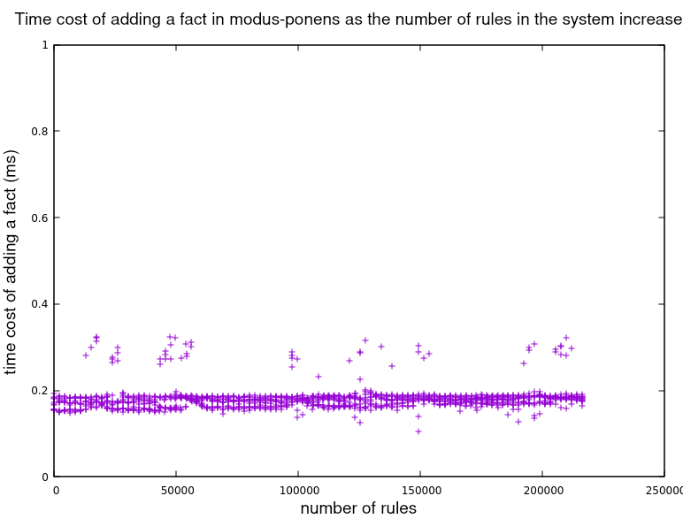
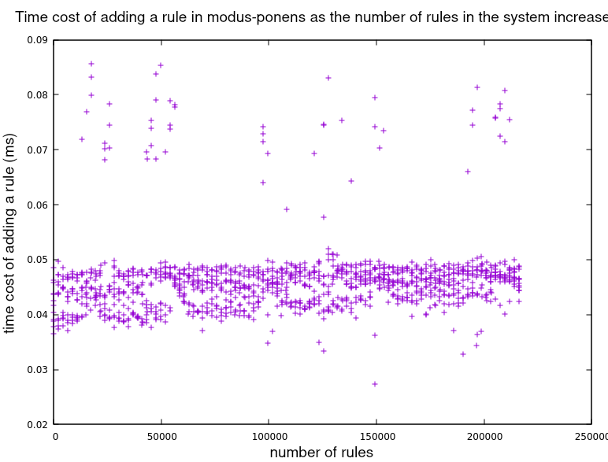

# modus_ponens.

NOTE: this is a mirror, for up to date links for modus\_ponens please visit
http://www.modus-ponens.net/

## Contents
1. [Introduction](#intro)
2. [Inference engines](#engines)
3. [modus_ponens](#mopo)
4. [Example](#example)
5. [API](#API)
6. [Complexity](#complexity)

## Introduction

modus_ponens provides forward chaining inference engines
that deal with facts whose syntax is prescribed by the user of the library.

The essence of modus_ponens is that the user describes how her data is structured
via a Parsing Expression Grammar (PEG),
and then modus_ponens provides an inference engine that deals with
knowledge bases made up of
facts and rules compliant with the provided PEG.

We might approach modus_ponens from 3 different traditional, established perspectives:

* modus_ponens can be understood from the perspective of logic programming,
  and be compared to the likes of Prolog or CLIPS;
* It can also be seen as a tool for data analysis,
  and be compared to SQL engines and other data structuring schemes;
* And it can be compared to the rules engines behind bussiness rules systems,
  such as Drools or JRules.

### From the perspective of logic programming.

If we look at it from the perspective of logic programming,
and compare it with the [CLIPS][5] progamming language (also with a forward chaining engine),
we might note that:

* It is fast. With hundreds or thousands of rules loaded in the system,
  it is the same order of magnitude fast as [CLIPS][5],
  and with tens and hundreds of thousands of rules, it is an increasing number of orders
  of magnitude faster than CLIPS (e.g., with 200 000 rules in the system, modus\_ponens
  is 4 orders of magnitude faster adding another rule, see the results below).
* It is customizable. There is total freedom in the syntax of the facts that
  can be fed to inference engines produced with modus\_ponens,
  since that syntax is provided by the user in the form of a PEG.
* It is scalable. The algorithmic cost (time and space) of adding
  both new facts and new rules to the system is independent of the amount of them already there.
  In this sense it must be noted that it uses a novel algorithm with little resemblance to [RETE][6].

These properties should make it very appropriate for knowledge representation and reasoning,
i.e. for logistic AI. 

### From the perspective of data analysis.

modus_ponens can help dealing with data.
The point here is that it is not necessary to transform the data to feed it to modus_ponens;
it is just necessary to provide modus_ponens with a PEG that describes the structure of the data to analyse,
and then the data can be added straight into a modus_ponens knowledge base.
Then it will be possible to add rules to the knowledge base
or query it at whatever level of structural detail that may be needed,
as specified in the PEG.

So for example to analyse and extract information from a set of logs,
the PEG would prescribe facts that reflect the structure of the log entries,
and then each entry would be fed into the knowledge base as a fact.

## Inference engines

Brief introduction to inference engines, to establish some terminologic common ground.

Inference engines deal with 2 basic kinds of objects: facts and rules.
The fundamental operational semantics of these objects, in forward chaining systems,
is three-fold:

1. Facts and rules are added by the user to the system;
2. Facts can match with rules, thus producing new facts not directly provided by the user
   (or, equivalently, triggering some other arbitrary actions);
3. The system can be queried for the presence of facts, according to some query language.

Popular examples of forward chaining inference engines are the one in CLIPS,
or the one behind the [Drools][7] Business Rules Management System.

Different engines provide different syntax for their facts.
For example, CLIPS uses [lisp style s-expressions][8],
and Drools uses some own ad-hoc syntax.

Rules are essentially made up of a number of conditions and an action,
where conditions are facts that can contain quantified, bound variables,
and actions can be anything to be triggered when the conditions of a rule are matched;
though here for our purposes it is enough to only consider as actions assertions of new facts,
possibly containing variables used in the conditions.

from a logical point of view, what these systems provide is, first, a syntax for facts
and for [Horn clauses][9]; and then, on top of that, an implementation of conjunction,
implication, and quantified variables, such as they appear in the Horn clauses.
This allows these systems to extend any set of facts and Horn clauses to its completion,
according to modus ponens.

## modus_ponens

What modus\_ponens provides is an implementation of logical conjunction and implication and
of quantified variables, and it does so, not on top of some particular syntax for the facts
that are conjoined or implied or that contain the variables, but on top of [PEG][10] parse trees.
For modus\_ponens, a fact is just a parse tree produced by the [Pest][11] PEG parser.
Thus, the user of the library can provide whatever PEG she chooses to define her space of facts.
In a sense, the user of the library provides the grammar for the facts,
and modus\_ponens provides the grammar to build rules out of those facts.
As a bridge between what modus\_ponens prescribes and what the user ad-libs,
the user needs to mark which of the productions that compose her facts
can be  in the range of the variables prescribed by modus\_ponens.
Otherwise, there is no restriction in the structure of the productions providing the facts.

## Example

As an example, we will develop a system that represents a simple taxonomy.
In this system, sentences have 2 basic forms:

1. taxon A is a sub-taxon of taxon B
2. individual A belongs to taxon B

We want the system to provide a complete view of our taxonomy;
So, for example, if we tell the system that Bobby belongs to Dog,
and also that Dog is a sub-taxon of Mammal, and then we query the system for mammals,
we want to obtain Bobby in the response.
For this, we will add 2 rules:

1. A is a sub-taxon of B & B is a sub-taxon of C -> A is a sub-taxon of C
2. A belongs to B & B is a sub-taxon of C -> A belongs to C

First of all, we must add some dependencies to our `Cargo.toml`:

```toml
[dependencies]
modus_ponens = "0.11.0"
modus_ponens_derive = "0.1.0"
pest = "2.1.2"
pest_derive = "2.1.0"
log = "0.4"
env_logger = "0.7.1"
```
&nbsp;
&nbsp;

Now, the grammar. It is Pest that interprets this grammar,
so look up the [Pest documentation][16] for its syntax.
Since we can use unicode, we'll do so.
For the "sub-taxon" predicate we'll use `⊆`, and for belongs, `∈`.
We also need names for the individuals and taxons,
for which we'll use strings of lower case latin letters.

```pest
var         = @{ "<" ~ "__"? ~ "X" ~ ('0'..'9')+ ~ ">" }

fact        = { name ~ pred ~ name }

pred        = @{ "∈" | "⊆" }

v_name      = @{ ASCII_ALPHANUMERIC+ }

name        = _{ v_name | var }

WHITESPACE  = { " " | "\t" | "\r" | "\n" }
```
&nbsp;
&nbsp;

In this grammar, the productions WHITESPACE and  `var` is prescribed by modus\_ponens.
On top of them, the user must provide a production for `fact`.
So we, as "user", are providing `name`, `v_name`, and `pred`, to compose `fact`.
Here we allow for very simple facts, just triples subject-predicate-object.

Note how we mark the production `v_name`, that can match variables, with a prefix "v_",
and mix it with `var` in a further `name` production.
We call these *logical* productions. 
In this case `v_name` is a terminal production, but it need not be so;
and there can be more than one production marked as logical.
So it is perfectly possible to represent higher order logics.

We store this grammar in a file named `grammar.pest`.

Then, we build our knowledge base based on the grammar. First some boilerplate:

```rust
extern crate modus_ponens;
#[macro_use]
extern crate modus_ponens_derive;

extern crate pest;
#[macro_use]
extern crate pest_derive;

#[derive(KBGen)]
#[grammar = "grammar.pest"]
pub struct KBGenerator;
```
&nbsp;
&nbsp;

This provides us with a `struct` `KBgenerator`, whose only responsibility is to
create knowledge bases that can hold facts and rules according to `grammar.pest`.
So we can build a knowledge base:

```rust
let kb = KBGenerator::gen_kb();
```
&nbsp;
&nbsp;

We can add rules to it:

```rust
kb.tell("<x0> ⊆ <X1> ∧ <X1> ⊆ <X2> → <X0> ⊆ <X2>.");
kb.tell("<X0> ∈ <X1> ∧ <X1> ⊆ <X2> → <X0> ∈ <X2>.");
```
&nbsp;
&nbsp;

We add some content:

```rust
kb.tell("human ⊆ primate.");
kb.tell("primate ⊆ animal.");
kb.tell("susan ∈ human.");
```
&nbsp;
&nbsp;

And we query the system:

```rust
assert_eq!(kb.ask("susan ∈ animal.", true);

assert_eq!(kb.ask("susan ⊆ animal.", false);
assert_eq!(kb.ask("primate ∈ animal.", false);
```
&nbsp;
&nbsp;

That completes a first approach to modus\_ponens.
To try the code in this example yourself, you can do as follows:

```bash
$ git clone <modus_ponens mirror>
$ cd modus_ponens/examples/readme-example
$ cargo build --release
$ RUST_LOG=trace ./target/release/readme-example
```
&nbsp;
&nbsp;

`RUST_LOG=trace` will log to stdout all facts and rules added in the system;
`RUST_LOG=info` will only log facts.

## API

TODO

TODO: document queries with variables,
TODO: document consecutive sets of conditions.
TODO: document arithmetic and string conditions and transformations.

## Complexity

We consider here that the state of the art in forward chaining inference engines are implementations
of variants of the RETE algorithm, with different kinds of heuristic improvements
but with no significative change in the fundamental complexity.
We use CLIPS 6.30 as reference implementation of RETE, managed from [PyCLIPS][12].
There is CLIPS 6.31 and 6.4beta, but we gather from their changelogs that
those new versions do not carry algorithmic improvements that would alter the results shown below,
and PyCLIPS is very convenient for benchmarking CLIPS - and only knows about CLIPS 6.30.

Now, with modus\_ponens, the cost of adding a new fact (or rule) to the system is only dependent
on the grammatical complexity of the fact (or of the conditions of the rule) being added,
and on the number of rules that the fact matches
(or on the number of facts that match a condition of the rule, when adding a rule).
In particular, those costs are independent of both the total number of facts in the system
and the total number of rules in the system.

This is due to the fact that all searches in the structures that represent the sets
of facts and rules in the system are made through hash table lookups;
there is not a single filtered iteration of nodes involved.

This is not the case for RETE:
With RETE, the cost of adding a fact or a rule increases with the total number
of rules in the system. At least, that is what the numbers below show.
Doorenboss in [his thesis][13] sets as objective for an efficient matching algorithm
one that is polynomial in the number of facts (WMEs) and sublinear in the number of
rules. He claims the objective to be achievable with his RETE/UL enhancement of RETE.
What I observe with CLIPS is a performance independent of the number of facts
and linear in the number of rules.

The benchmarks shown below consisted on adding 200 000 rules and 600 000 facts,
where every 2 rules would be matched by 6 of the facts to produce 4 extra assertions.
Every 1000 rules added we would measure the time cost of adding a few more rules and facts.
We are showing the results of 3 runs. Each run took modus\_ponens around 2 minutes,
and CLIPS around 7 hours, in my i5-8250U @1.60GHz laptop.
[This is the code for the CLIPS benchmark][14]
and [this for modus\_ponens][15].

First we see the effect of increasing the number of rules in the system
on the time the system takes to process each new fact.
CLIPS shows a (seemingly constantly) increasing cost,
whereas modus\_ponens persistently takes the same time for each fact.


Zooming in on modus\_ponens data:



Some results which we do not plot,
gave evidence to the effect that maintining the number of rules,
and increasing the number of facts in the system,
had no effect on the cost of adding new facts or rules,
for any of the systems.
In fact, in the case of modus\_ponens the above graph can be taken as evidence that the cost
does not depend on the number of facts,
since the number of facts increases with th number of rules.

The next results show the effect that increasing the total number of rules
had on the cost of adding a new rule. Again, in CLIPS the cost seems to increase continuously,
whereas in modus\_ponens the cost seems independent of the number of rules.


Zooming in on modus\_ponens data:




It is worth noting that in modus\_ponens, contrary to CLIPS, it is much cheaper adding rules
that adding facts.

I also measured the peak memory allocated by the process as measured by [heaptrack][17],
with different numbers of facts and rules. I don't have enough data to plot it,
but preliminary results show a constant spatial cost per fact of around a KB,
independently of the number of facts and rules already in the system.
There is room for improvement in this sense, as a KB / fact is way more
than strictly needed.

[0]:http://www.modus-ponens.net/
[1]:https://www.rust-lang.org
[2]:https://en.wikipedia.org/wiki/Forward_chaining
[3]:https://en.wikipedia.org/wiki/Inference_engine
[4]:https://en.wikipedia.org/wiki/Production_system_%28computer_science%29
[5]:http://www.clipsrules.net/
[6]:https://en.wikipedia.org/wiki/Rete_algorithm
[7]:https://www.drools.org
[8]:https://en.wikipedia.org/wiki/S-expression
[9]:https://en.wikipedia.org/wiki/Horn_clause
[10]:https://en.wikipedia.org/wiki/Parsing_expression_grammar
[11]:https://pest.rs
[12]:https://pyclips.sourceforge.net/web/
[13]:http://reports-archive.adm.cs.cmu.edu/anon/1995/CMU-CS-95-113.pdf
[14]:https://gitlab.com/enriquepablo/modus_ponens/-/blob/mirrors/python/benchmark_clips.py
[15]:https://gitlab.com/enriquepablo/modus_ponens/-/blob/mirrors/examples/isa-bench/src/main.rs
[16]:https://pest.rs/book/grammars/syntax.html
[17]:https://www.kdab.com/heaptrack-v1-0-0-release/

---

© Enrique Pérez Arnaud &lt;enrique at cazalla.net&gt; 2020
